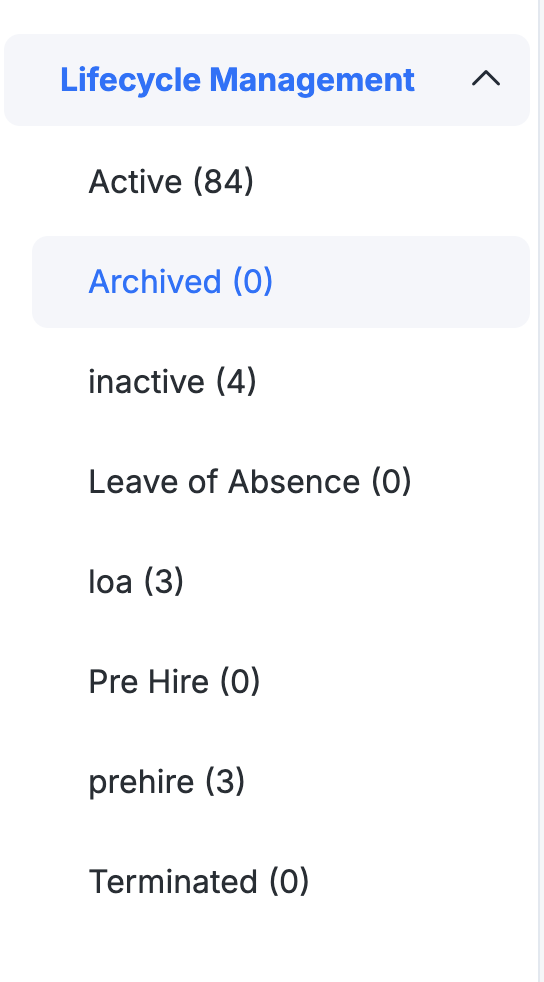
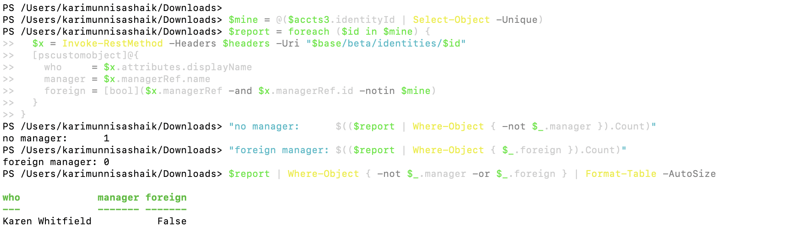
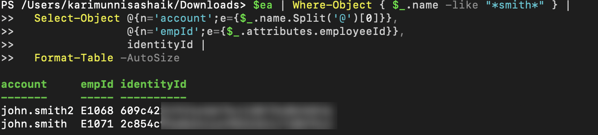
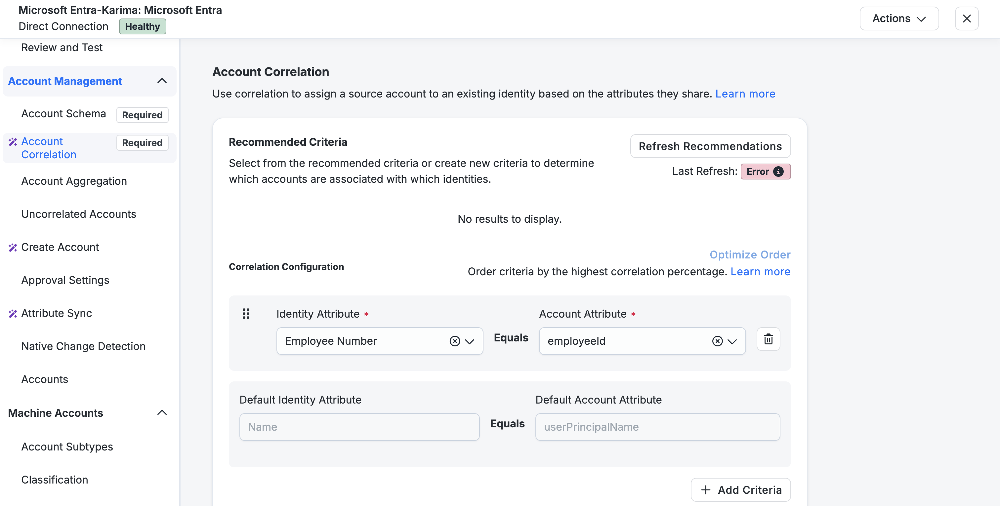
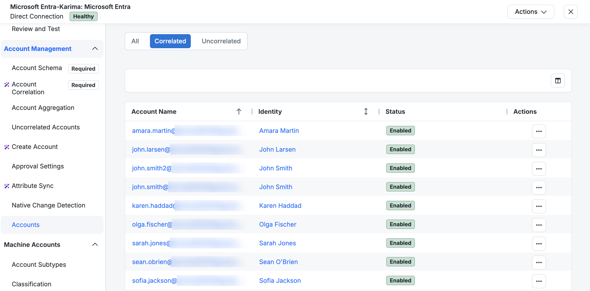
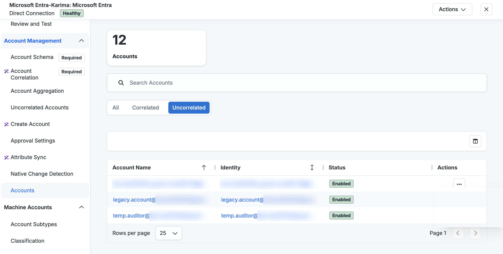

# Building the HR authoritative source — and six failures on the way

Karimunnisa-s · 29 September 2026

Goal: load a 94-employee HR file into SailPoint as an authoritative source, turn
those accounts into identities, and correlate a Microsoft Entra source against
them on employee ID.

That is a one-hour task when it works. It took four days, and every one of the
delays was worth more than the task itself. This write-up covers what broke, how
I found each cause, and what I would check first next time.

The environment is a shared training tenant with a virtual appliance I deployed
on GCP. The data is entirely fictional — 94 invented employees at a made-up
company. Tenant URLs, IP addresses and credentials are deliberately absent.

## Where it ended up

| | |
|---|---|
| HR accounts aggregated | 94 |
| Distinct identities created | 94 |
| HR accounts failing to produce an identity | 0 |
| Entra accounts | 12 |
| Entra accounts correlated on employee ID | 9 |
| Entra accounts correctly left uncorrelated | 3 |


The three uncorrelated accounts are a temp auditor, a legacy service account and
an external guest — seeded without an employee ID on purpose, so that something
*should* fail to correlate. A correlation test where everything matches proves
very little.

---

## 1. A source configured to fetch a file from nowhere

**Symptom.** Aggregation failed with *"Connector failed to complete aggregation.
Connector may not be sending responses. This aggregation has been tried (2) times
without success."* The source reported 0 accounts and an "incomplete
configuration" banner, with no indication of what was incomplete.

**Investigation.** I dumped the connector attributes for every source in the
tenant and compared mine against ones that were working:

| | Mine | A working source |
|---|---|---|
| `filetransport` | `sftp` | `sftp` |
| `host` | *(empty)* | *(set)* |
| `port` | *(empty)* | `22` |
| `transportUser` | *(empty)* | *(set)* |
| `file` | a path | a path |
| `status` | `SOURCE_STATE_UNCHECKED_SOURCE_NO_ACCOUNTS` | — |

**Root cause.** The source was set to fetch its file over SFTP but had no host,
port or credentials. It had a path to a file on a server that was never named.

**Fix.** Put the CSV on the appliance itself and pointed the connector at the
appliance's internal address.

**What I'd check first next time.** A delimited source that reports zero accounts
and a vague aggregation failure — read `connectorAttributes` before touching
anything else. The configuration page showed a green-looking source; the
attribute dump showed the holes in one glance.

---

## 2. The last surviving appliance in a shared cluster

**Symptom.** *"Timeout waiting for response to message 2 from client … after 15
seconds"* on every Test Connection. The appliance showed **Connected**.

**Investigation.** SFTP worked when I ran it by hand on the appliance, so
credentials, path and port were all fine. The connector gateway log told a
different story:

```
"message":"Cannot find key to decrypt message"
com.sailpoint.pipeline.util.Decrypter.decryptObject → IllegalStateException
```

Repeating every 15–30 seconds, continuously, with timestamps unrelated to
anything I was doing.

The cluster listing explained it. Four appliances, three of them inactive since
a week earlier, mine the only one connected.

**Root cause.** Decryption keys are per-appliance. My appliance was the only live
member of a shared cluster, so it picked up every queued message for that
cluster — including work encrypted for the three dead appliances, which it had no
key for. My own request sat behind traffic it could only fail on.

A side effect worth flagging: messages my appliance consumed and failed to
decrypt were messages the intended appliance never received. I told the trainer.

**Fix.** Created my own cluster, re-paired the appliance to it, re-pointed the
source.

**The reasoning that got there.** The errors were continuous and unrelated to my
clicks. An error stream that keeps running while you do nothing is ambient, not
triggered — so the fault was not in the thing I was testing.

---

## 3. Connector secrets are encrypted per cluster

**Symptom.** Immediately after moving the source to the new cluster:
*"Failed to decrypt cluster-encrypted connector secret."*

**Root cause.** The SFTP password was encrypted with the old cluster's key. The
new cluster's appliance holds a different key and cannot read it.

**Fix.** Re-entered the password so it was re-encrypted under the new cluster.

**Prevention.** Moving a source between clusters invalidates every stored secret
on it. Nothing warns you at the point of the move; it surfaces later as a
decryption error at connection time. Re-enter credentials as part of any
re-clustering, not as a reaction to the failure.

---

## 4. Usernames are unique per tenant, not per identity profile

**Symptom.** 94 accounts aggregated. 24 identities created. No error on the
source, no error on the aggregation.

**Investigation.** The identity exception report listed ~40 rows, all
*"Non-unique username"*. Half the rows were not my data at all — they were other
students' identities, shown as the other side of each collision.

**Root cause.** I had mapped the identity username to the employee ID. Another
identity profile in the shared tenant had already claimed employee IDs in the
same range. Usernames must be unique across the whole tenant, so the overlapping
ones were rejected. The 24 that succeeded were exactly the IDs nobody else held.

**Fix.** A transform that prefixes the employee ID, making the username unique by
construction rather than by luck.

**Prevention.** In a shared environment, derive usernames from something
namespaced to you. And read the identity exception report early — the failure was
invisible on the source and on the aggregation, and only that report named it.

---

## 5. An account name that wasn't a name

This is the one worth reading.

**Symptom.** After fixing the usernames: 94 accounts, and 48 identities. Nothing
errored.

**Investigation.** I compared distinct identity IDs against the account count,
then grouped accounts by the identity they had landed on:

```
6 accounts → one identity
6 accounts → one identity
5 accounts → one identity
5 accounts → one identity
4 accounts → one identity
```

Listing the worst group showed six different employee IDs — and one shared
value in the account **name** column: `John`.

**Root cause.** The source's Account Name attribute was mapped to the employee's
first name. Accounts were therefore matched by name, and every employee sharing a
first name was merged into a single identity. The group sizes were the frequency
distribution of first names in the file; 48 was roughly the number of distinct
first names among 94 people.

Every earlier symptom was downstream of this.

**Fix.** Account ID and Account Name both set to the employee ID. That cannot be
changed once accounts exist, so the source had to be rebuilt — which meant
deleting the identity profile first, then the transforms that referenced the
source by name, then the source itself.

Result: 94 accounts, 94 distinct identities, zero failures.

**Why it matters beyond the lab.** A merged identity is not a cosmetic problem.
Two employees on one identity means terminating one of them acts on both, or on
neither. It fails silently — no error, no exception report entry, just counts
that quietly stop making sense.

**Prevention.** An account identifier must be unique per person. Names are not
identifiers. Verify by comparing distinct identity count against account count
immediately after the first aggregation, before building anything on top.

---

## 6. A rebuilt identity profile silently loses its mappings

**Symptom.** After the rebuild, one Entra account carried employee ID `E1006` and
still would not correlate, while nine others matched cleanly.

**Investigation.** Opening that identity showed Manager as `--` and no Employee
Number at all — while the identity itself existed, was `active`, and belonged to
the right profile.

**Root cause.** The identity profile was recreated from scratch after the source
rebuild, and the **Employee Number** and **Manager** mappings were not re-added.
Correlation matches the account's `employeeId` against the identity's
`employeeNumber`; with that attribute unmapped, there was nothing on the identity
side to match. The nine that worked did so on a different criterion.

**Fix.** Re-added both mappings and reprocessed. Manager resolved to the right
person, employee number populated, and the account correlated on the next
aggregation.

**Prevention.** Rebuilding a profile means re-establishing every mapping, not
just the ones that produce visible output. Email and display name are obvious
when missing; employee number is invisible until something tries to match on it.

---

## 7. Three console figures that were snapshots, not state

A recurring theme, and the thing that cost the most time overall.

| What I read | What it actually was |
|---|---|
| Identity profile's identity count | A cached counter. Read 24 for three days while 94 identities existed; later read 84 against a verified 94. |
| Identity exception report | A stored task result. Re-downloading produced a byte-identical file three days later — same rows, same order. |
| Correlation recommendations | *"No identities found. Please aggregate accounts for an authoritative source"* — while 94 identities demonstrably existed. It reads a search index that lags, and still shows an error on the correlation page today. |

Each of these looked like live state and was not. Twice I concluded a fix hadn't
worked when it had.

**The habit that fixed it:** count the objects directly.

```powershell
"accounts:     $($accts.Count)"
"identities:   $(($accts.identityId | Select-Object -Unique).Count)"
"uncorrelated: $(($accts | Where-Object { $_.uncorrelated }).Count)"
```

Three numbers, and between them they distinguish "nothing processed", "merged
identities" and "records failed" — none of which the console distinguishes on its
own.

One detail that cost an hour on its own: `identityId` is populated on an account
even when the account is not correlated. The reliable flag is `uncorrelated`.
I drew a wrong conclusion from the wrong field before checking what the field
actually meant.

---

## 8. Aggregation optimization hides fixed configuration

After correcting the username mapping, the identity count didn't move. The
configuration was right and the numbers said otherwise.

Aggregation skips accounts whose source data hasn't changed. My CSV was
byte-identical, so every account was treated as unmodified and the previously
failed records were never re-evaluated. A configuration fix does not retroactively
repair records created under the broken configuration.

To force a full pass I added a column to the file so every row hashed
differently. In the end the source was rebuilt anyway, which made the point moot —
but the lesson holds, and it is a common source of "the fix didn't work" when the
fix was fine.

---

## Verification

Three checks I ran once the pipeline was working, because "it loaded" is not the
same as "it is correct".

### Lifecycle states match the source data exactly

A lookup transform maps the HR `status` column to an ISC lifecycle state. Counting
both sides:

| CSV `status` | Rows | Lifecycle state | Identities |
|---|---|---|---|
| Active | 84 | `Active` | 84 |
| Terminated | 4 | `inactive` | 4 |
| Prehire | 3 | `prehire` | 3 |
| Leave of Absence | 3 | `loa` | 3 |
| | **94** | | **94** |



The four terminated employees are `inactive`, not `active` — which is the control
the whole leaver process depends on.

*Housekeeping note:* the profile also carries three empty states — `Leave of
Absence`, `Pre Hire`, `Terminated` — created with display-style names before I
settled on technical names. The transform emits the technical names, so those
three can never be reached. Unreachable states that look meaningful are worth
deleting rather than leaving for someone else to puzzle over.

### The manager graph has no dangling references

Every identity's manager should resolve to another identity in the same
population, with exactly one exception — the CEO.

```
no manager:      1      (Karen Whitfield, Chief Executive Officer)
foreign manager: 0
```



A manager reference pointing at nothing is how approval workflows stall: the
request routes to an approver who does not exist, and it sits in the queue until
somebody notices. Worth checking at load time rather than discovering later.

### Two people who share a name stay separate

The dataset contains two employees called John Smith, on purpose. Their Entra
accounts correlate to two different identities:

```
account        empId   identityId
john.smith2    E1068   609c42…
john.smith     E1071   2c854c…
```



Correlation keys on the employee ID, so the shared name is irrelevant. That is the
same principle as finding 5, seen from the other side: when matching keys on a
name, people merge; when it keys on an identifier, they don't.

It is a more convincing demonstration having watched six Johns collapse into one
identity earlier the same day.

---

## Infrastructure notes

Smaller items, kept because each cost real time.

**A firewall rule's source ranges are a union.** `default-allow-ssh` carried both
`0.0.0.0/0` and a `/32` for my home address. Adding the `/32` narrowed nothing —
a packet matches if it matches *any* range, so SSH was open to the internet the
whole time I believed it was restricted. Found by verifying a claim I was about
to publish. Fixed by replacing the range list rather than adding to it.

**`gcloud compute ssh` does not work on the appliance.** It is a hardened image
without Google's guest agent, so metadata SSH keys are ignored. Connecting
directly as the appliance's own user works; the serial console works when nothing
else does.

**Ephemeral external IPs change on every stop/start.** I lost time three separate
times connecting to an address that no longer belonged to the VM. Reserved a
static address. The source configuration was unaffected throughout because it
points at the internal address, which is stable — that turned out to be a better
decision than I realised when I made it.

---

## Entra correlation

With identities correct, correlating the Entra source was configuration rather
than archaeology: account attribute `employeeId` → identity attribute
`employeeNumber`.



Of 12 accounts, 9 correlated and 3 did not — the three with no employee ID to
match on.




Those three are a temp auditor, a legacy service account and an external guest.
In a real tenant they are exactly the population that matters: accounts nobody
owns, which is what an access certification is for.

**Not yet done:** provisioning. ISC reads this directory but does not yet write to
it, so Entra is currently a governed source rather than a managed target. Account
creation, update and disable are the next piece of work, and until they exist a
leaver test cannot prove that access is actually removed.

---

## What I'd tell someone starting this

1. After the first aggregation, compare distinct identity count against account
   count. If they differ, stop and fix the account identifier before building
   anything.
2. Read the identity exception report early. Failures there are invisible
   everywhere else.
3. Don't trust summary counts, cached reports or recommendation panels. Count the
   objects — and check what a field actually means before drawing a conclusion
   from it.
4. A continuous error stream with timestamps unrelated to your actions is
   ambient, not triggered — look outside the thing you're testing.
5. In a shared tenant, assume every namespace is contested: usernames, employee
   ID ranges, cluster queues.
6. Rebuilding an object means re-establishing everything that referenced it.
7. Verify claims before writing them down. The firewall rule I was about to
   describe as restrictive was not.

---

*Fictional data throughout. Tenant identifiers, hostnames, addresses and
credentials are deliberately omitted; internal object identifiers are partially
redacted in screenshots.*
